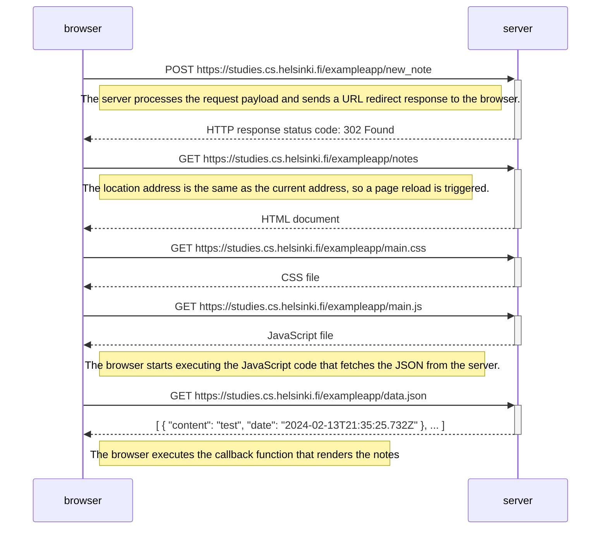

The following is a diagram depicting the situation where the user creates a new note on the page https://studies.cs.helsinki.fi/exampleapp/notes by writing on the text field and clicking the *Save* button.

Operations on the browser or on the server are shown as comments in the diagram.

